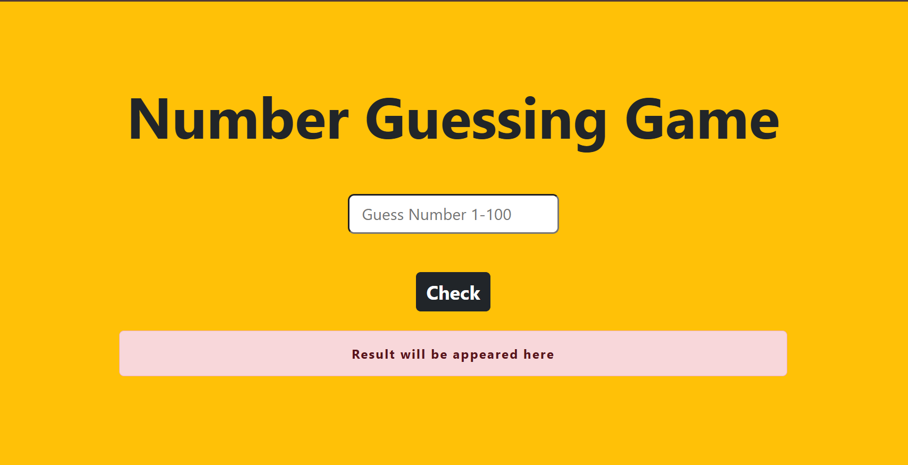

# 🎯 Number Guessing Game

A fun and interactive **Number Guessing Game** built with pure HTML, CSS, and JavaScript — styled beautifully using Bootstrap 5. Test your luck and see if you can guess the randomly generated number between 1 and 100!

---

## 🌐 Live Demo

> If you deploy this on GitHub Pages, replace this line with your live link:  
> 🔗 [Play the Game](https://loedex.github.io/Number-Guessing-Game/)

---

## 📸 Preview

> *(Add a screenshot of your project here by uploading an image to your repo and linking it like below)*  
> 

---

## 📁 Project Structure
```
number-guessing-game/
│
├── index.html       # Main HTML structure of the game
├── style.css        # Custom CSS styles
└── logic.js         # JavaScript game logic
```

---

## 🚀 Features

- 🎲 Randomly generates a number between **1 and 100** on every guess
- ✅ Instantly tells you if your guess is **correct or wrong**
- 📱 **Fully Responsive** layout powered by Bootstrap 5
- 🎨 Clean and colorful UI with a bold, centered design
- ⚡ Lightweight — no frameworks or build tools required

---

## 🛠️ Built With

| Technology | Purpose |
|---|---|
| HTML5 | Structure of the webpage |
| CSS3 | Custom styling and resets |
| JavaScript (Vanilla) | Game logic |
| [Bootstrap 5.3.2](https://getbootstrap.com/) | Responsive layout and UI components |

---

## 📖 How to Play

1. Open the game in your browser
2. Type a number between **1 and 100** in the input field
3. Click the **"Check"** button
4. Read the result
   
> 💡 **Note:** A new random number is generated on **every click**, so each guess is a fresh challenge!

---

## ⚙️ How It Works

Here's a quick breakdown of the JavaScript logic:
```javascript
function NumberGuessing() {
    let num = Math.floor(Math.random() * 100); // Generates a random number (0–99)
    let inNum = document.getElementById("a01").value; // Gets user input
    if (num == inNum) {
        document.getElementById("a02").innerText = "Great! You guessed correct";
    } else {
        document.getElementById("a02").innerText = "Sorry! You guessed wrong";
    }
}
```

- `Math.random()` generates a float between `0` and `1`
- `Math.floor()` rounds it down to a whole number
- The result is compared with the user's input and feedback is displayed

---

## 💻 Getting Started

Follow these simple steps to run the project locally on your machine:

### Prerequisites

You just need a **web browser** — that's it! No installations required.

### Steps

1. **Clone the repository**
```bash
   git clone https://loedex.github.io/Number-Guessing-Game/
```

2. **Navigate into the project folder**
```bash
   cd Number-Guessing-Game
```

3. **Open `index.html` in your browser**
```bash
   # On Windows
   start index.html

   # On Mac
   open index.html

   # Or simply drag and drop index.html into your browser!
```

---


## 🤝 Contributing

Contributions are always welcome! If you'd like to improve this project:

1. Fork the repository
2. Create a new branch (`git checkout -b feature/your-feature-name`)
3. Make your changes
4. Commit your changes (`git commit -m 'Add some feature'`)
5. Push to the branch (`git push origin feature/your-feature-name`)
6. Open a **Pull Request**

---

## 📄 License

This project is open source and available under the [MIT License](./LICENSE).

---

## 👨‍💻 Author

**Your Name**  
🔗 [GitHub](https://github.com/loedex) • [LinkedIn](www.linkedin.com/in/husnain-ahmad-911b883a6)

---

